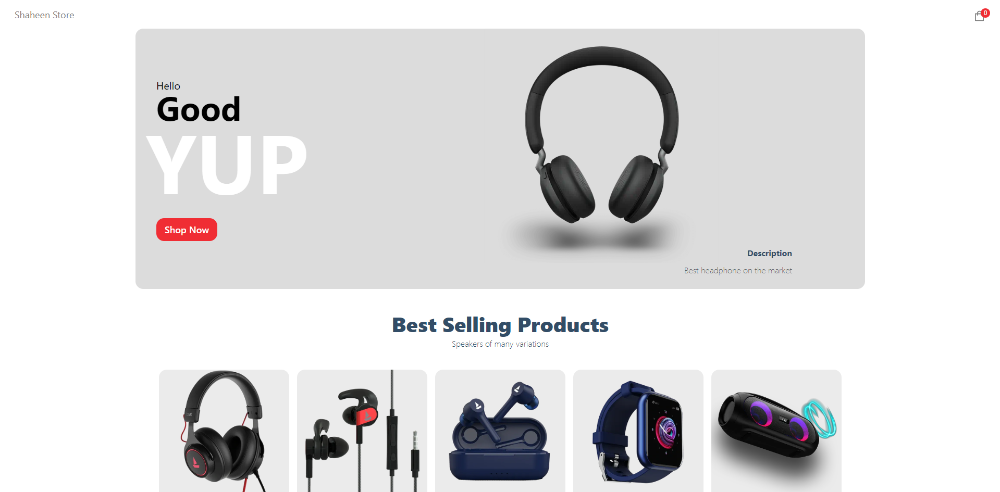
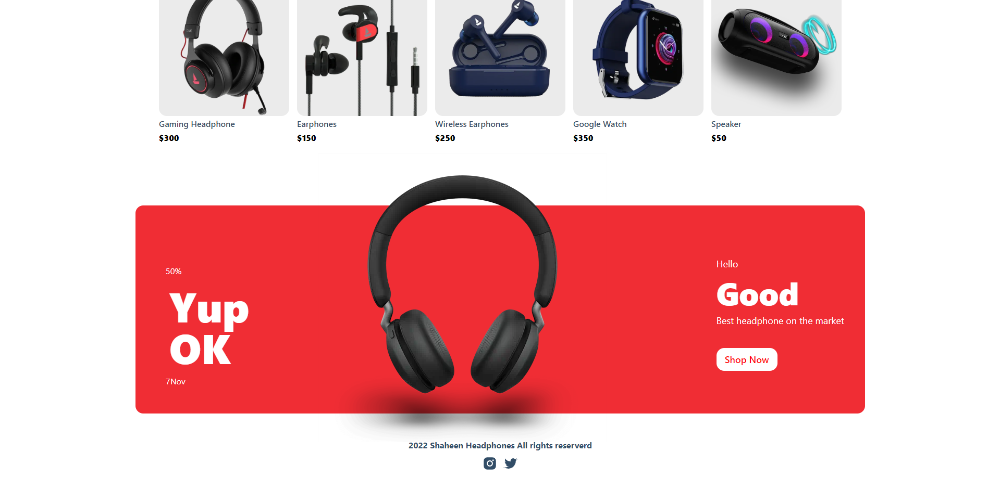
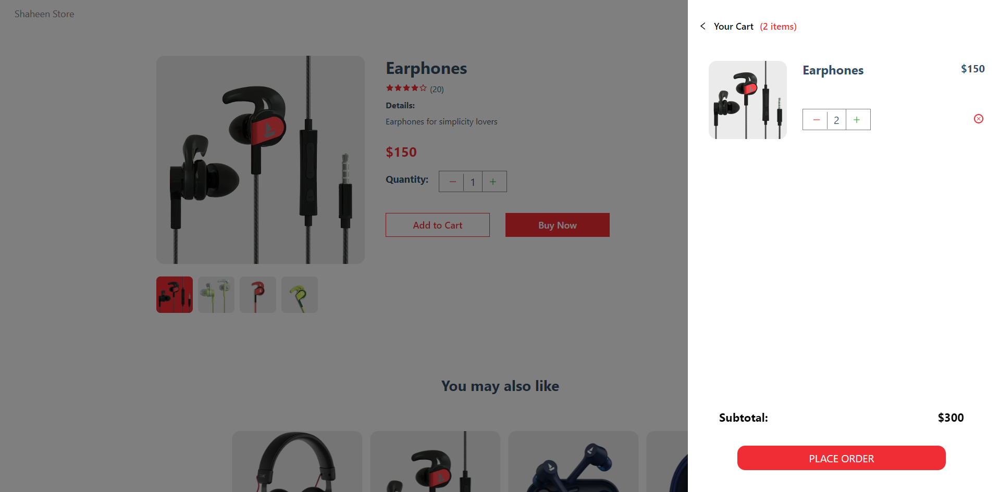

# E-commerce website Using NextJS, Sanity, and Vercel 

## Welcome! 👋
Thanks for checking out this Application.
E-commerce store built with Next.js and Sanity. It features a wide range of products, including clothing, electronics, and home goods. Users can browse the products, add them to their cart, and checkout. The web page also features a blog section where users can learn more about the products and the company.

## Overview

### Links

- Solution URL: [Github](https://github.com/Shaheen121/ecommerce-nextjs-sanity.git)
- Live Site URL: [Live Site](https://ecommerce-nextjs-sanity-r4b1jjsvh-shaheen121.vercel.app/)

## My process

### Built with

- Next Js
- Sanity
- Vercel
- CSS
- JavaScript
- JSX

## Author

- Linkedin - [@aous-shaheen-381636221](https://www.linkedin.com/in/aous-shaheen-381636221/)
- Facebook - [@aoushaheen7](https://www.facebook.com/shaheen7tl/)

By me 🚀🚀🚀
Aous Shaheen
...
